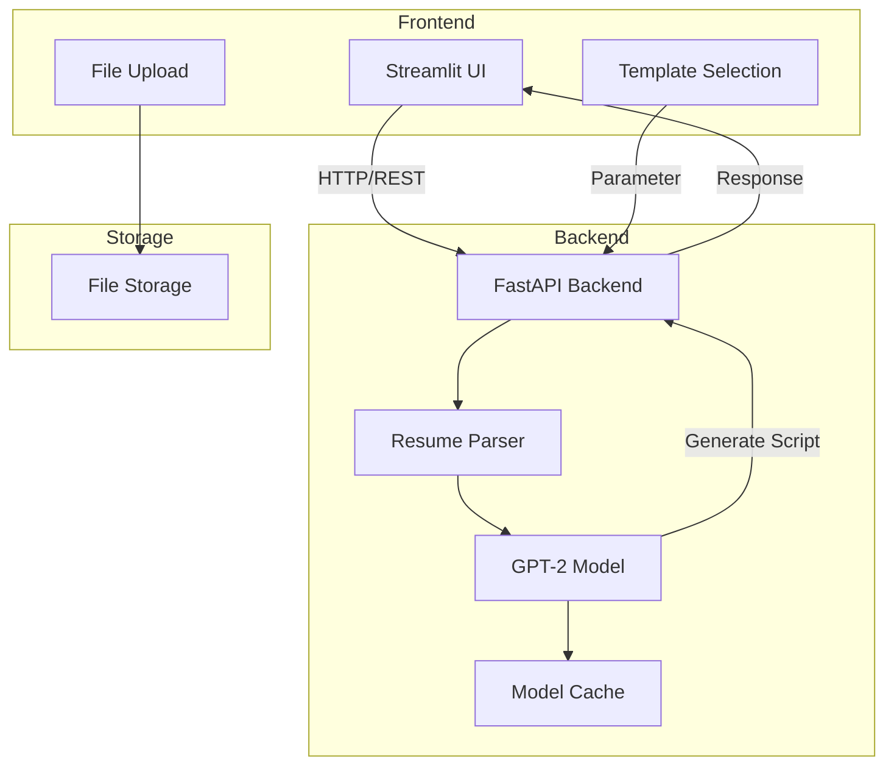
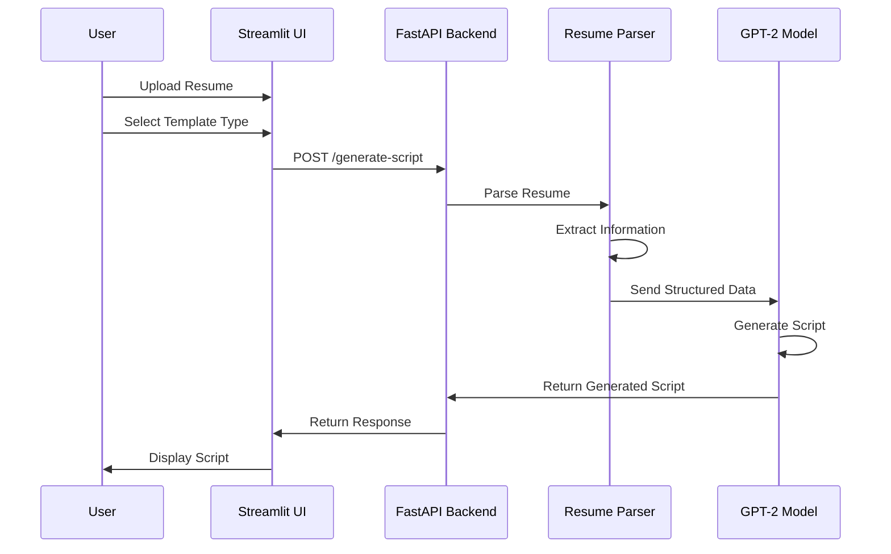

# Resume Video Script Generator

A powerful tool that generates engaging video scripts from resume templates using GPT-2 and modern web technologies. The system supports multiple industries including IT, Restaurant Management, and Healthcare.

## Features

- **Multi-Industry Support**
  - IT/Software Development: Optimized for technical roles and skills
  - Restaurant Management: Tailored for hospitality and food service
  - Healthcare: Specialized for healthcare professionals

- **Intelligent Script Generation**
  - Industry-specific templates and prompts
  - Dynamic content adaptation based on skills and experience
  - Professional tone and structure

- **Modern Web Interface**
  - Streamlit-based UI for easy interaction
  - Real-time script generation
  - User-friendly file upload

- **Robust Backend**
  - FastAPI for high-performance API
  - GPT-2 model with custom prompt engineering
  - Specialized resume parsers

## Quick Start

### Prerequisites
- Python 3.11+
- Docker (recommended) or Python virtual environment

### Option 1: Using Docker (Recommended)

1. Clone the repository:
```bash
git clone https://github.com/TS-Group5/Resume-Summarization.git
cd Resume-Summarization
```

2. Build the Docker image:
```bash
docker build -t resume-summarization .
```

3. Run the container:
```bash
docker run -p 8080:8080 -p 8502:8502 resume-summarization
```

4. Access the application:
- Frontend UI: http://localhost:8502
- API Documentation: http://localhost:8080/docs

### Option 2: Local Development

1. Clone the repository:
```bash
git clone https://github.com/TS-Group5/Resume-Summarization.git
cd Resume-Summarization
```

2. Create and activate virtual environment:
```bash
python -m venv .venv
source .venv/bin/activate  # On Windows: .\.venv\Scripts\activate
```

3. Install dependencies:
```bash
# For basic installation
pip install -e .

# For development (includes testing and linting tools)
pip install -e ".[dev]"
```

4. Start the FastAPI backend:
```bash
# Terminal 1
uvicorn src.api.app:app --host 0.0.0.0 --port 8080
```

5. Start the Streamlit frontend:
```bash
# Terminal 2
streamlit run src/ui/streamlit_app.py --server.port 8502 --server.address 0.0.0.0
```

6. Access the application:
- Frontend UI: http://localhost:8502
- API Documentation: http://localhost:8080/docs

### Using the Application

1. Open the Streamlit UI in your browser (http://localhost:8502)
2. Upload a resume file (supported format: .docx)
3. Select the industry type:
   - IT/Software
   - Restaurant Management
   - Healthcare
4. Click "Generate Script" to create the video script
5. View and use the generated script

## Configuration

The application uses a `config.yaml` file for configuration. Key settings include:
- Server ports and hosts
- API endpoints
- Model parameters
- File configurations

## Development

### Running Tests
```bash
# Run all tests
pytest

# Run tests with coverage report
pytest --cov=src

# Run specific test file
pytest tests/test_specific_file.py
```

### Code Quality
The project includes several tools for maintaining code quality:
- `black`: Code formatting
- `isort`: Import sorting
- `flake8`: Code linting

Run them using:
```bash
# Format code
black src tests

# Sort imports
isort src tests

# Check code quality
flake8 src tests
```

## Project Structure

```
Resume-Summarization/
├── src/
│   ├── api/                 # FastAPI backend
│   │   └── app.py          # Main API endpoints
│   ├── models/             # ML models
│   │   └── generic_gpt2_model.py  # GPT-2 implementation
│   ├── parsers/            # Resume parsers
│   │   ├── resume_parser.py
│   │   ├── ats_parser.py
│   │   └── industry_manager_parser.py
│   ├── templates/          # Resume templates
│   └── ui/                 # Streamlit frontend
│       └── streamlit_app.py
├── docs/                   # Documentation
└── requirements.txt        # Python dependencies
```

## Implementation Details

### GPT-2 Model Configuration
- Base model: GPT-2
- Custom prompt engineering for industry-specific content
- Parameters:
  - Max length: 800
  - Min length: 300
  - Temperature: 0.7
  - Top-p: 0.9
  - Top-k: 50
  - Repetition penalty: 1.2

### Script Generation Process
1. Resume parsing and data extraction
2. Industry detection based on role and skills
3. Template selection and prompt construction
4. GPT-2 text generation
5. Post-processing and validation

### Supported Industries
Each industry has specialized templates for:
- Introduction and background
- Professional experience
- Skills and expertise
- Achievements
- Goals and aspirations
- Contact information

## System Architecture



## Application Flow



## Contributing

Contributions are welcome! Please read our contributing guidelines and submit pull requests to our repository.

## License

This project is licensed under the MIT License - see the LICENSE file for details.
