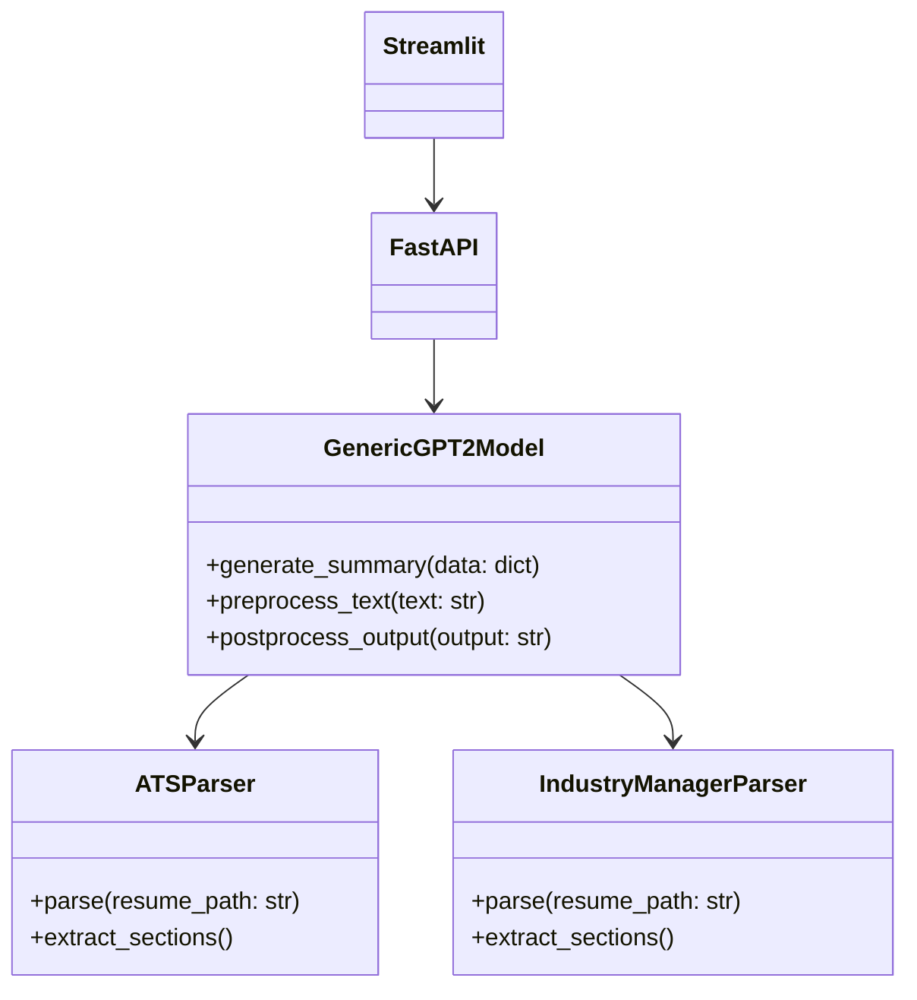

# Resume Video Script Generator Documentation

This directory contains detailed documentation for the Resume Video Script Generator system, which creates engaging video scripts from resume templates.

## System Architecture

The system consists of three main components:
1. FastAPI Backend
2. Streamlit Frontend
3. Core Processing Components

### Core Components

- [Models](./models.md)
  - GenericGPT2Model: Generates video scripts using fine-tuned GPT-2
  
- [Parsers](./parsers.md)
  - ATSParser: Parses ATS/HR resume templates
  - IndustryManagerParser: Parses Industry Manager resume templates

## API Endpoints

### POST /generate-script
Generates a video script from an uploaded resume.

**Request:**
- Method: POST
- Content-Type: multipart/form-data
- Body: file (resume.docx)

**Response:**
```json
{
    "script": "Generated video script content",
    "template_type": "ATS/HR or Industry Manager"
}
```

## User Interface

The Streamlit UI provides:
1. File upload for resume templates
2. Real-time script generation
3. Script preview and download options

## Docker Deployment

The system runs in a Docker container with two services:
- FastAPI backend on port 8000
- Streamlit UI on port 8501

### Running with Docker

```bash
# Build the image
docker build -t resume-video-generator .

# Run the container
docker run -p 8000:8000 -p 8501:8501 resume-video-generator
```

## Class Relationships



## Templates

The system supports two resume templates:
1. `ATS classic HR resume.docx`: Optimized for HR and recruitment positions
2. `Industry manager resume.docx`: Tailored for industry management roles
